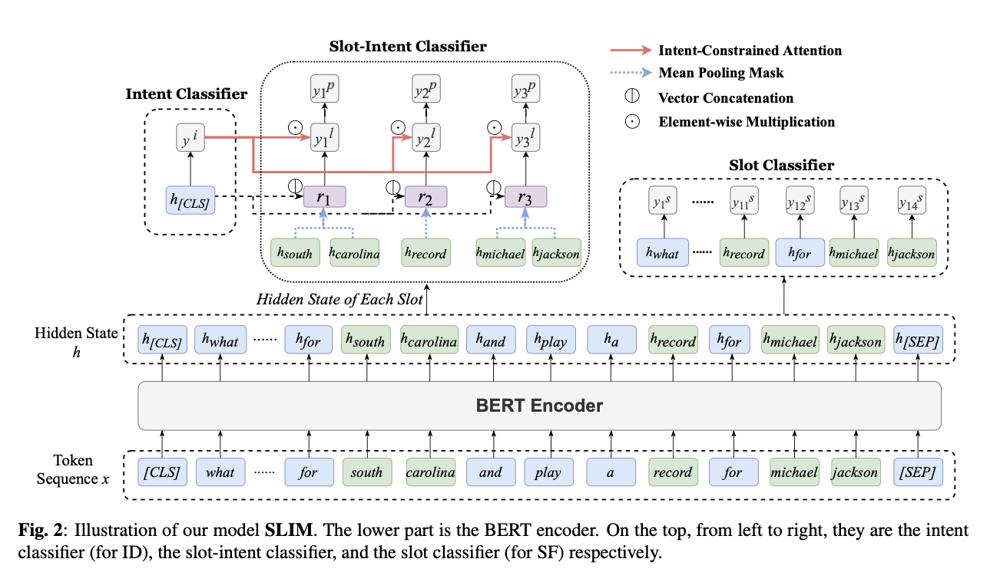
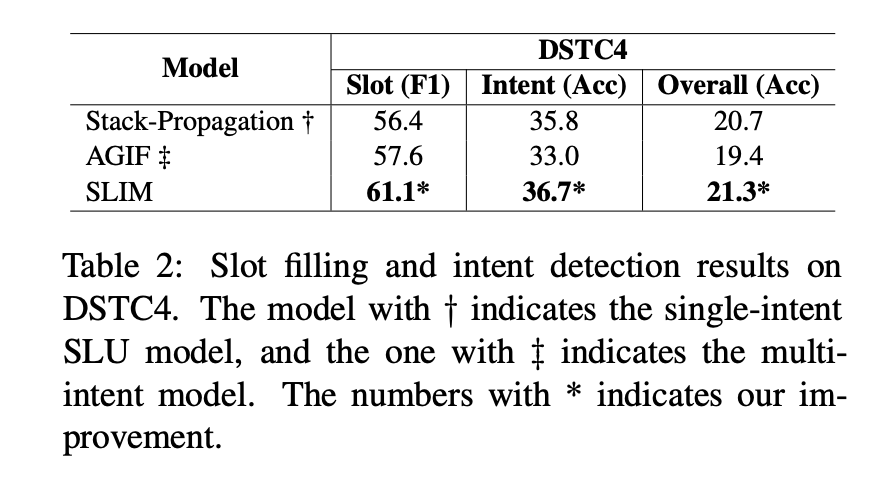

# SLIM: Explicit Slot-Intent Mapping with BERT for Joint Multi-Intent Detection and Slot Filling

Pytorch implementation of `SLIM`: Explicit Slot-Intent Mapping with BERT for Joint Multi-Intent Classification and Slot Filling

# Update 22 Nov 2022
We have updated the dataset, and also adjust the code. The updated result and paper will be updated very soon.

## Insight
The previous multi-intent works predict intents and slots by feeding the same coarse-grained information distribution to assist slot prediction. However, in the multi-intent setting, different slots are mapped to different intents. Therefore, we take advantage of the slot-intent mapping to guide the intent detection and slot filling.

<p float="left" align="center">
      
</p>

## Model Architecture

<p float="left" align="center">
      
</p>

- Predict `intent` and `slot` at the same time from **one BERT model** (=Joint model)
- total\_loss = intent_loss + slot\_coef \* slot\_loss + slot\_intent\_coef \* slot\_intent\_loss

## Dependencies
Please refer to `requirements.txt`

## Dataset
- The following table includes the train/dev/test split of MixSNIPS and MixATIS. Also, we reports the number of intent labels and slot labels in the training set. Also, based on the mechanism of MixSnips / MixATIS construction, we label the slot-level intent.

|       | Train  | Dev | Test | Intent Labels | Slot Labels |
| ----- | ------ | --- | ---- | ------------- | ----------- |
| MixATIS  | 13,161  | 759 | 828  | 21            | 118         |
| MixSnips | 39,776 | 2,198 | 2,199  | 7             | 71          |

- Also, we use DSTC4. The contact of data is [Teo Poh Heng](mailto:Teo_Poh_Heng@hq.a-star.edu.sg)
- The number of labels are based on the _train_ dataset.
- Add `UNK` for labels (For intent and slot labels which are only shown in _dev_ and _test_ dataset)
- Add `PAD` for slot label

## Training & Evaluation
All experiments are conducted using a single GeForce GTX TITAN X GPU.

```bash
$ python3 main.py --task {task_name} \
                  --model_type {model_type} \
                  --model_dir {model_dir_name} \
                  --do_eval

# For MixSNIPS
$ python3 main.py --task mixsnips \
                --model_type multibert \
                --model_dir mixsnips_model \
                --multi_intent 1 \
                --intent_seq 0 \
                --tag_intent 1 \
                --BI_tag 1 \
                --intent_attn 1 \
                --cls_token_cat 1 \
                --num_mask 6 \
                --slot_loss_coef 2 \
                --patience 0 \
                --seed 25\
                --do_train

# For MixATIS
$ python3 main.py --task mixatis \
                --model_type multibert \
                --model_dir mixatis_model \
                --multi_intent 1 \
                --intent_seq 0 \
                --tag_intent 1 \
                --BI_tag 1 \
                --intent_attn 1 \
                --cls_token_cat 1 \
                --num_mask 6 \
                --slot_loss_coef 2 \
                --patience 0 \
                --seed 12\
                --do_train
```

## Prediction
```bash
$ python3 main.py --task {task_name} \
                  --model_type {model_type} \
                  --model_dir {model_dir_name} \
                  --do_eval

# For MixSNIPS
$ python3 main.py --task mixsnips \
                --model_type multibert \
                --model_dir mixsnips_model \
                --multi_intent 1 \
                --intent_seq 0 \
                --tag_intent 1 \
                --BI_tag 1 \
                --intent_attn 1 \
                --cls_token_cat 1 \
                --num_mask 6 \
                --slot_loss_coef 2 \
                --patience 0 \
                --seed 25 \
                --do_eval

# For MixATIS
$ python3 main.py --task mixatis \
                --model_type multibert \
                --model_dir mixatis_model \
                --multi_intent 1 \
                --intent_seq 0 \
                --tag_intent 1 \
                --BI_tag 1 \
                --intent_attn 1 \
                --cls_token_cat 1 \
                --num_mask 6 \
                --slot_loss_coef 2 \
                --patience 0 \
                --seed 12 \
                --do_eval
```

## Results

- We will later provide the detailed hyperparameter settings
- Only test with `uncased` model

<p float="left" align="center">
      
</p>
<p float="left" align="center">
      
</p>


## References

- [Huggingface Transformers](https://github.com/huggingface/transformers)
- [pytorch-crf](https://github.com/kmkurn/pytorch-crf)
- [JointBert](https://github.com/monologg/JointBERT)

